# AFM 二维聚合物薄膜力学分析 — 进度记录

> 自动生成的分析日志。每次运行追加新章节。

## 项目概览

- **样品**: JJS (<10nm COF薄膜, SiN孔), linker系列 (50-80nm 结晶COF, 铜网), k80系列 (50-80nm, 铜网)
- **探针**: RTESPA-150 (R=8nm, k=7N/m), DDESP-V2 (R=100nm, k=89N/m)
- **关键修正**: extend=approach/loading, retract=unloading/pull-off (2026-04-25 RealRaw 分支分离)
- **核心发现**: JJS retract pull-off ~115.9 nN >> extend snap-in ~17.3 nN (~7.0x), 液桥-膜顺应性耦合放大

---

## 运行记录

### 2026-06-04 09:37 — 自动分析 #20260604-0937

**摘要**: 本批次分析覆盖三个 RealRaw 数据集（20260409 JJS 11 对曲线, 20260415 linker 系列 69 对, 20260416 k80 系列 49 对）。JJS approach/loading 段吸引力中位数为 **17.3 nN**（IQR 14.0--20.7 nN），与经典 vdW + capillary 估算值 **10.2 nN** 同量级，仅高出 **1.7 倍**。retract/unloading 段 pull-off 粘附力中位数 **115.9 nN**（IQR 108.2--131.0 nN），约为 approach 吸引力的 **7.0 倍**，说明强信号来自接触后液桥/界面钉扎导致的回撤粘附和耗散。k80 系列内 apparent modulus 排序为 **PAA > PFNA > SDBS**。

### 1. 样品体系与探针参数

| 日期 | 主要样品 | 探针 | 半径 (nm) | k (N/m) | 曲线对数 | 主要用途 |
|------|---------|------|----------|---------|---------|---------|
| 20260409 | JJS | RTESPA-150 | 8 | 7 | 11 | approach 吸引力、retract 粘附、滞后与水桥机制 |
| 20260415 | linker1/linker2 | RTESPA-150 | 8 | 7 | 69 | linker 系列粘附差异；linker2-PAA 深压入对照 |
| 20260416 | k80 系列 | DDESP-V2 | 100 | 89 | 49 | PAA/PFNA/SDBS 表观力学对比 |

### 2. 力曲线处理方法

- **extend = approach/loading**: baseline 校正 → snap-in 检测（负力极小值）→ 接触点定位 → post-contact 正力加载段
- **retract = unloading/pull-off**: pull-off 检测（回撤分支最强负力）→ 回撤面积积分 → 滞后功计算
- **baseline**: 远场低相互作用区（Z ∈ [0, 100] nm）线性拟合扣除
- **QC 标准**: baseline 稳定性、曲线点数、单位一致性、深压入最小深度/正力阈值、膜模型 R²
- **力统一为 nN，位移和压入深度统一为 nm**

### 3. Approach 吸引力：范德华力与毛细力

#### 3.1 理论模型

球-平面范德华力（量级估算）：

$$F_{vdW} = \frac{A R}{12 d_0^2}$$

完全润湿上限毛细桥力：

$$F_{cap} = 4\pi R \gamma \cos\theta$$

#### 3.2 理论量级估算（R = 8 nm, A = 4×10⁻¹⁹ J, d₀ = 0.3 nm, γ = 72 mN/m）

- F_vdW ≈ **3.0 nN**
- F_cap ≈ **7.2 nN**
- 合计 ≈ **10.2 nN**

#### 3.3 JJS extend 吸引力与理论对比

- JJS approach snap-in 实测中位数: **17.3 nN** [14.0--20.7 nN]
- 实测/理论比值: **1.7x** — 同量级
- 结论: 仅需稍大的有效润湿半径、较强亲水界面或局部水桥成核即可解释观测量级，不需要异常 Hamaker 增强
- 注意: 反推的有效毛细半径或 Hamaker upper bound 只能用于量级判断，不能作为唯一微观机制证明

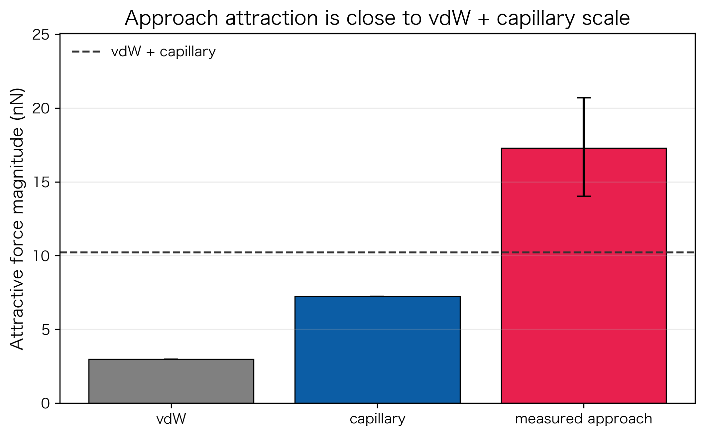

### 4. Retract 粘附力与界面滞后

#### 4.1 pull-off force 定义
pull-off force 是 unloading 曲线中最强负力，代表探针从已形成接触/液桥状态脱离薄膜所需克服的最大粘附力，反映的是**接触后界面脱粘**，不是 approach 阶段的远程吸引力。

#### 4.2 JJS retract 粘附力统计
- JJS retract pull-off 中位数: **115.9 nN** [108.2--131.0 nN]
- pull-off / snap-in 比值中位数: **7.0 倍**
- 该值远高于 approach 吸引力，说明强信号发生在接触形成后的回撤阶段

#### 4.3 加载/卸载不对称性的物理机制

最合理的物理图像：
1. 接近时形成水桥或局部接触
2. 回撤时水桥被拉伸，三相接触线在亲水/粗糙/缺陷位点钉扎
3. 导致负压、延迟断裂和明显能量耗散

当前数据支持限域水桥作为候选机制，但**不能独立分离** solvation force、静电力和真实水桥几何。
关键缺失对照：湿度控制、悬浮/支撑对比、不同探针半径、速度依赖性。

#### 4.4 滞后功
滞后功 = |加载面积 − 卸载面积|，表示单次加卸载周期中的耗散量级。JJS 的滞后功显著大于 linker 和 k80 系列。

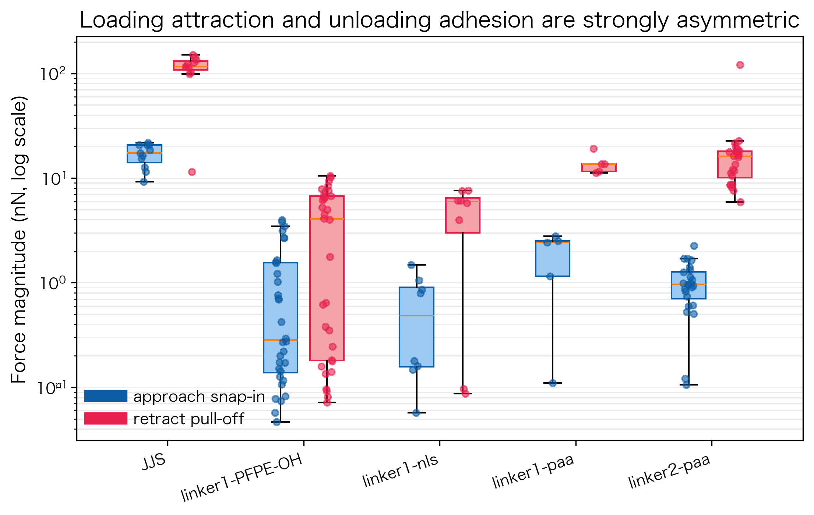
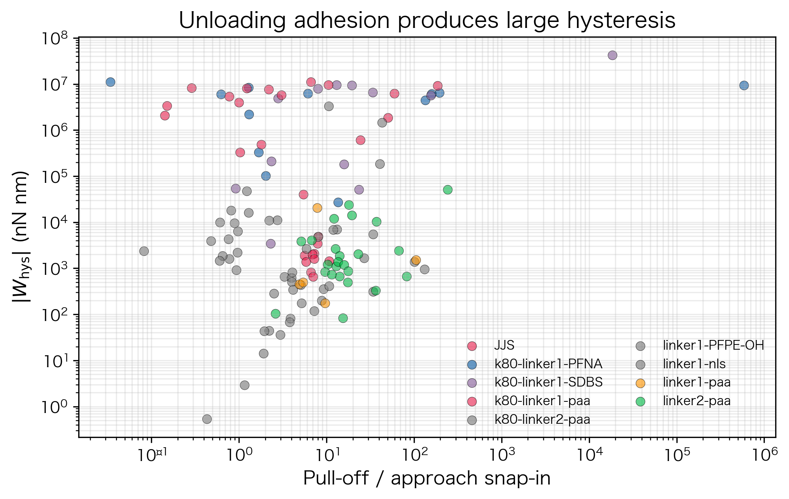

### 5. 样品间粘附差异

| 组别 | 曲线对数 | approach 吸引力 / nN | retract 粘附力 / nN | pull-off/snap-in |
|------|---------|---------------------|--------------------|-------------------|
| JJS | 11 | 17.29 [14.01, 20.68] | 115.92 [108.19, 130.95] | 7.02 [6.22, 7.60] |
| linker1-PFPE-OH | 32 | 0.28 [0.14, 1.55] | 4.06 [0.18, 6.72] | 3.13 [1.21, 5.37] |
| linker1-nls | 8 | 0.49 [0.16, 0.91] | 5.94 [2.99, 6.48] | 8.07 [3.26, 28.77] |
| linker1-paa | 5 | 2.43 [1.16, 2.51] | 13.57 [11.58, 13.59] | 7.87 [5.40, 9.66] |
| linker2-paa | 24 | 0.96 [0.70, 1.27] | 16.06 [10.05, 18.04] | 14.82 [12.01, 20.36] |

- JJS 的回撤粘附显著强于其接近段吸引力，也强于多数 linker 系列
- linker 系列中 PAA 相关样品具有更高 pull-off，提示亲水/带电界面对液桥稳定性和接触线钉扎有增强作用
- pull-off force 是本数据中较稳健的实验量（回撤分支清晰负力极值），但限制在于它不是单一物理力

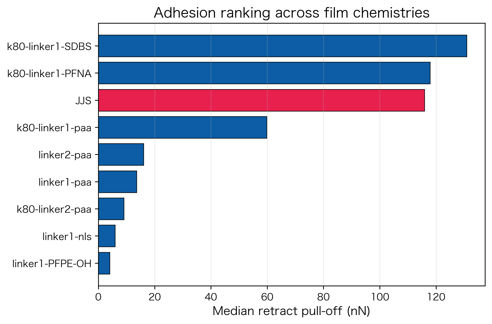

### 6. 深压入曲线与滑脱拼接

- **筛选标准**: 足够 post-contact 正力点、最大压入深度和最大排斥力达到深压入阈值
- **recoverable slip**: 力突然下降后后续曲线重新回到上升趋势 → 可用于连续 loading 重构
- **terminal cliff**: 末端大幅掉落且不恢复（破膜/脱粘/不可逆接触变化）→ 只保留 cliff 前数据
- **stitching 方法**: 对 recoverable slip 后整段施加累计垂直 force offset，使 post-slip 段接到 pre-slip 趋势上。原始力保留为 raw force，stitched force 仅作为拟合视图
- **物理边界**: 不适用于断裂强度分析；terminal cliff 之后不做任何修复

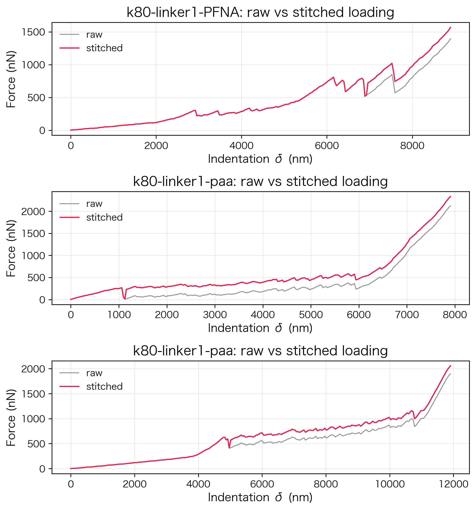
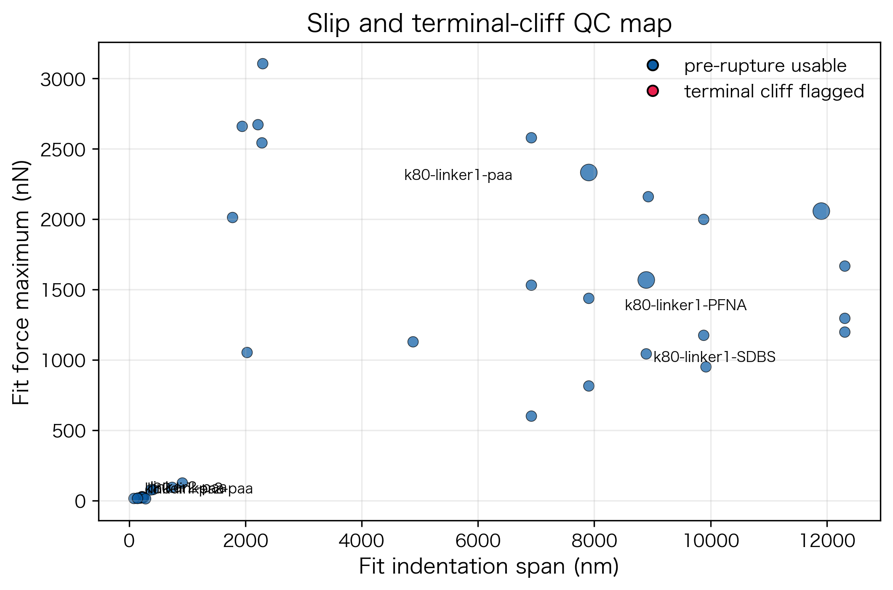

### 7. 薄膜力学模型

采用夹持圆形悬膜的 AFM 压入模型 [Lee 2008, Bertolazzi 2011]：

$$F = k_1\delta + k_3\delta^3$$

- **k₁δ**: 线性项，合并预张力、边界顺应性和低压入接触刚度
- **k₃δ³**: 三次项，反映大变形膜拉伸主导的非线性承载

model-dependent apparent Young's modulus：

$$E_{app} = \frac{k_3 a^2}{q^3 t}, \quad q = \frac{1}{1.05 - 0.15\nu - 0.16\nu^2}$$

- 默认参数: 孔半径 a = 10 μm, 泊松比 ν = 0.30, 主膜厚 t = 50 nm（另给 t = 80 nm 敏感性）
- **E_app 不是本征杨氏模量**，只能用于同一探针、同一批次、同一模型下的相对力学排序
- 由于 E_app ∝ a²/t，孔径误差平方放大，膜厚误差线性传递

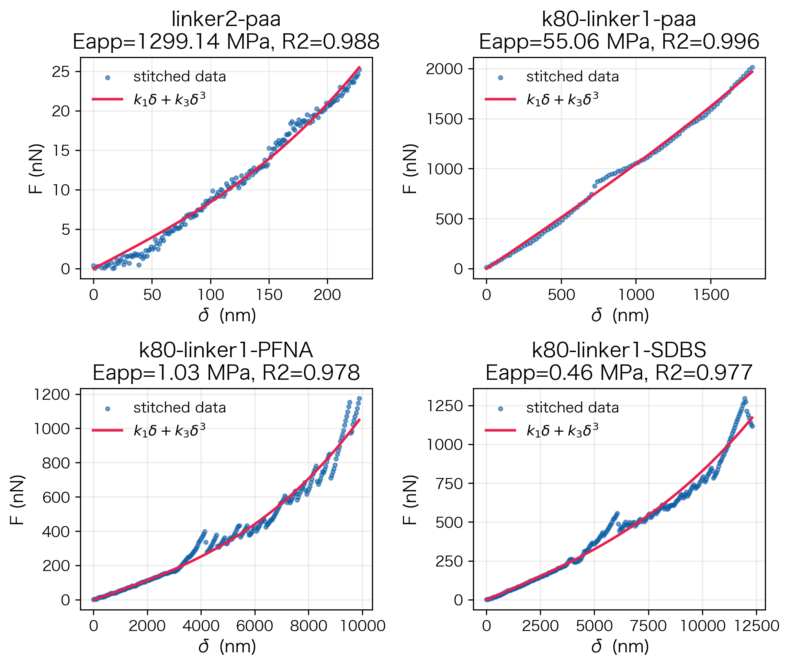
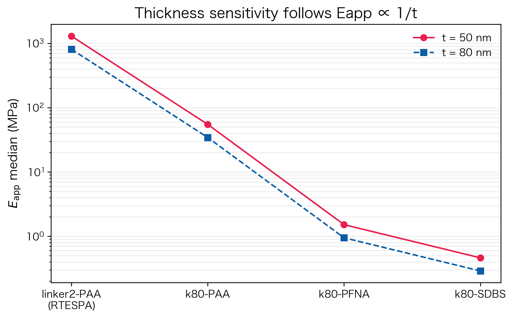

### 8. 表面活性剂对薄膜力学性能的影响

| 日期 | 组别 | 有效曲线 | E_app 50nm / MPa | E_app 80nm / MPa | k_high / N/m | R² |
|------|------|---------|------------------|------------------|-------------|-----|
| 20260415 | linker2-PAA | 15 | 1299.139 [1011.447, 2184.340] | 811.962 | 0.170 | 0.988 |
| 20260416 | k80-linker1-PAA | 11 | 55.064 [2.778, 104.348] | 34.415 | 1.007 | 0.994 |
| 20260416 | k80-linker1-PFNA | 6 | 1.517 [0.982, 2.308] | 0.948 | 0.276 | 0.972 |
| 20260416 | k80-linker1-SDBS | 3 | 0.463 [0.349, 0.584] | 0.289 | 0.161 | 0.976 |
| 20260416 | k80-linker2-PAA | 0 | -- [--, --] | -- | -- | -- |

**k80 系列内部排序: PAA > PFNA > SDBS**

- **k80-linker1-PAA**: E_app 中位数十 MPa 级，承载力最高
- **k80-linker1-PFNA**: E_app 低 MPa 级，提示较弱有效承载路径或更多局部软化区域
- **k80-linker1-SDBS**: 亚 MPa 到低 MPa，N = 3（标注 low-N 风险，仅做趋势讨论）
- **linker2-PAA**: GPa 级 apparent modulus，R² 中位数 ~0.99，可重复性最高；但因探针半径和测试条件不同，不宜直接与 k80 系列做绝对优劣比较

表面活性剂 → 形貌和缺陷 → 有效承载网络 → AFM 深压入力学响应。PAA 更高的刚度和模量提示更连续的承载网络；PFNA/SDBS 的低模量更符合缺陷密度更高的情形。该因果链仍需形貌和膜厚证据闭合。

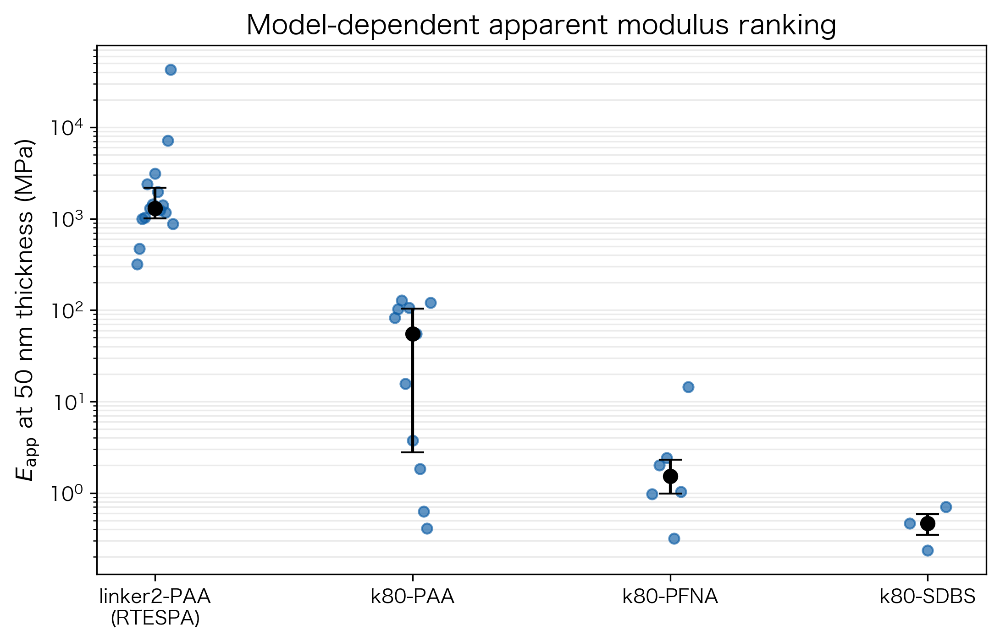
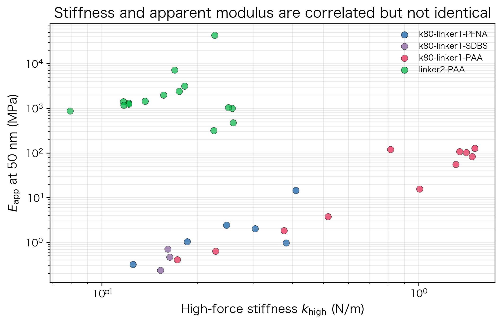

### 9. 误差棒与统计表达

- **中心值与离散度**: 以每条有效曲线为统计单元，使用 median + IQR（非 mean ± SD），直接反映样品内部不均一性和缺陷导致的曲线间变异
- **模型拟合质量**: R² 和残差趋势评估；R² 高说明 k₁δ + k₃δ³ 能描述 stitched loading 包络，不代表模型假设完全真实
- **膜厚敏感性**: t 从 50→80 nm 时 E_app 乘以 50/80 = 0.625
- **low-N 标注**: N < 5 的组只做趋势讨论（SDBS 组 N=3, k80-linker2-PAA N=0）
- **推荐图示**: 单曲线散点叠加 median+IQR 误差棒，同时展示中心趋势、离散度和异常值

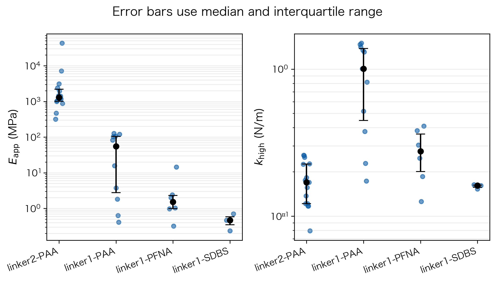

### 10. 与其他薄膜材料的量级比较

- **软聚合物薄膜（PDMS 类）**: ~1–3 MPa — k80-PFNA 和 k80-SDBS 接近此区间
- **水凝胶/软界面薄膜**: kPa 到低 MPa — 较软表面活性剂组接近软凝胶/弹性体边界
- **超薄无机/有机复合膜**: linker2-PAA 的 GPa 量级接近刚性聚合物薄膜或部分多孔有机薄膜
- **核心发现**: 不是达到无缺陷二维晶体极限，而是表面化学使实际承载路径跨越多个数量级

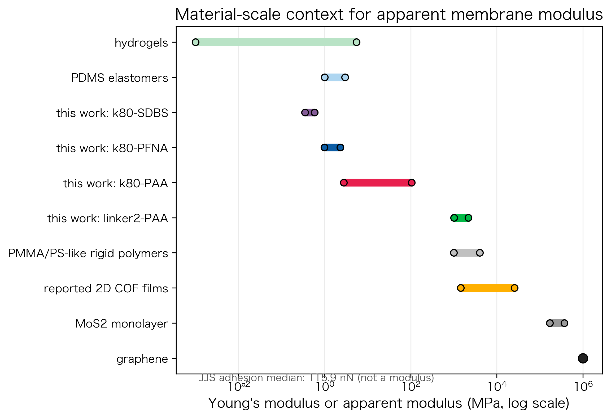

### 11. 可提取物理量与科学结论

| 类别 | 物理量 | 解释边界 |
|------|--------|---------|
| 可稳健提取 | approach attraction scale | 远程吸引力 + 动态 snap-in 量级 |
| 可稳健提取 | retract pull-off adhesion | 接触后脱粘/液桥断裂强度 |
| 可稳健提取 | hysteresis work | 加载/卸载耗散量级 |
| 可稳健提取 | apparent modulus ranking | 同模型下相对薄膜承载能力 |
| 半定量 | effective capillary radius | 吸收润湿、粗糙和水桥几何的有效参数 |
| 半定量 | effective Hamaker upper bound | 会混入毛细和静电贡献 |
| 不可单独提取 | solvation force / true bridge geometry | 需要湿度、干氮、KPFM 或探针半径系列 |
| 不可单独提取 | intrinsic Young's modulus | 需要独立膜厚、边界和接触模型验证 |

### 12. 总结与后续实验建议

**主要结论**:

1. 接近段吸引力处于 vdW + capillary 合理量级；真正显著的非对称性出现在回撤粘附和滞后中
2. JJS pull-off/snap-in 比值 7.0 倍支持液桥拉伸、界面钉扎和延迟断裂的物理图像
3. 深压入结果表明表面活性剂显著改变悬膜有效承载网络：PAA 更强的承载能力，PFNA/SDBS 更软
4. 同一 k80 系列内最可靠的排序为 **PAA > PFNA > SDBS**；linker2-PAA 显示 GPa 级最高可重复性
5. 所有模量均为 model-dependent apparent modulus，不解释为本征 Young's modulus

**后续实验建议**:

- 膜厚统计（SEM 截面 / 椭偏仪）—— 当前最大不确定性来源
- AFM height/phase 或 SEM/TEM 形貌 —— 闭合缺陷-结构-性能因果链
- 湿度/干氮对照实验 —— 分离水桥贡献
- 不同探针半径系列（R = 8, 100 nm）—— 验证接触力学模型
- 悬浮 vs 支撑对比 —— 排除基底效应
- 增大低 N 组样本量（尤其是 SDBS）

### 13. 文献参考

1. Butt, H.-J.; Cappella, B.; Kappl, M. *Surface Science Reports* **2005**, 59, 1–152. https://doi.org/10.1016/j.surfrep.2005.08.003
2. Israelachvili, J. N. *Intermolecular and Surface Forces*, 3rd ed.; Academic Press, 2011.
3. Lee, C.; Wei, X.; Kysar, J. W.; Hone, J. *Science* **2008**, 321, 385–388.
4. Bertolazzi, S.; Brivio, J.; Kis, A. *ACS Nano* **2011**, 5, 9703–9709.
5. Jagiełło, J.; et al. *Gels* **2024**. https://pmc.ncbi.nlm.nih.gov/articles/PMC11944691/
6. Su, T.; et al. *ACS Macro Letters* **2016**, 5, 1217–1221.
7. Liu, M.; et al. *Advanced Science* **2023**. https://pmc.ncbi.nlm.nih.gov/articles/PMC10700310/
8. Xiong, L.; et al. *Chemical Science* **2025**, 16, 15913–15925. https://doi.org/10.1039/D5SC02180D

### 14. 关键图表

*图: JJS approach 吸引力与 vdW + capillary 理论量级对比*

*图: extend snap-in 与 retract pull-off 对比（纵轴 log scale）*

*图: pull-off/extend ratio 与 hysteresis work 分布*

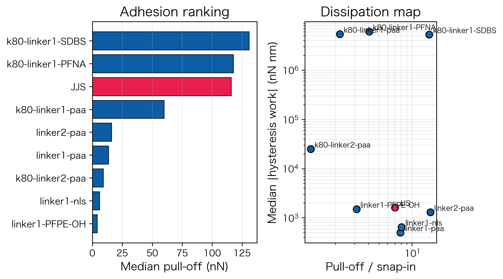
*图: 不同组别粘附滞后对比*

*图: 不同样品 retract pull-off 粘附力排序*

*图: 深压入曲线拼接前后对比*

*图: 滑脱事件分布图*

*图: 代表性膜模型拟合曲线（F = k₁δ + k₃δ³）*

*图: 膜厚敏感性分析（50 nm vs 80 nm）*

*图: 不同表面活性剂 E_app 散点图（median + IQR）*

*图: apparent stiffness vs apparent modulus*

*图: 带原始散点、median 和 IQR 的力学性能图*

*图: 本体系 apparent modulus 与文献中典型薄膜材料模量范围对比*

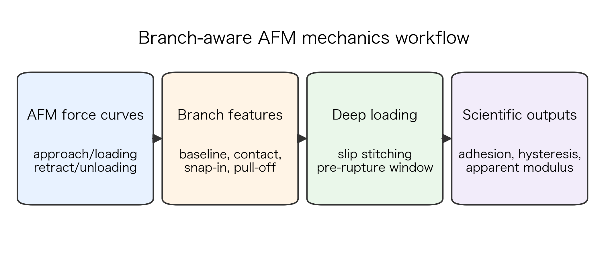
*图: AFM 力曲线分析流程图*

**完整报告**: [afm_scientific_report.md](JJS_project/reports/realraw/scientific_report/afm_scientific_report.md)
